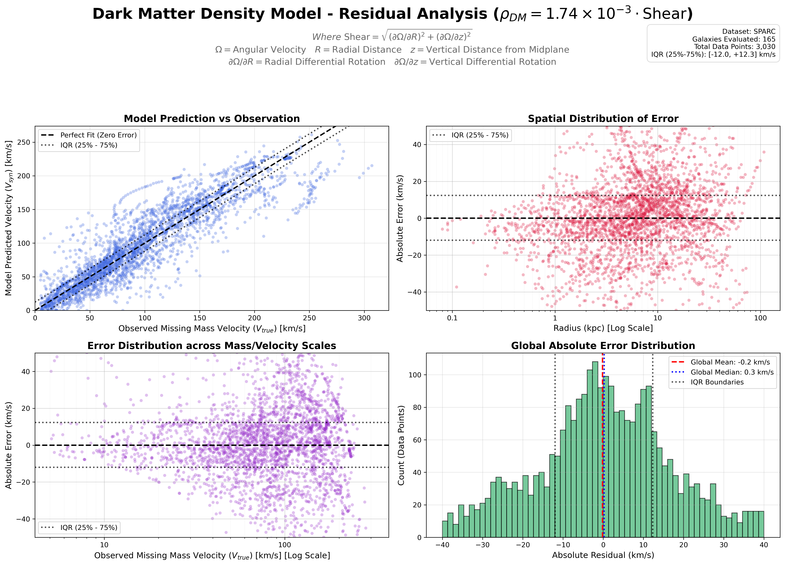
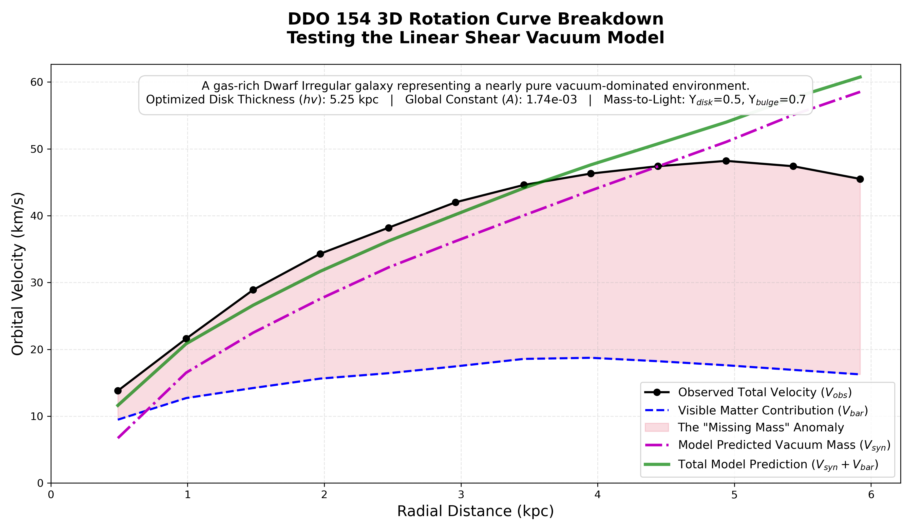
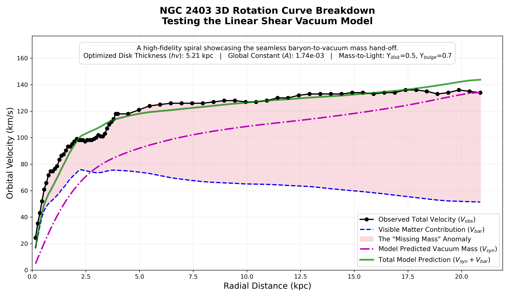
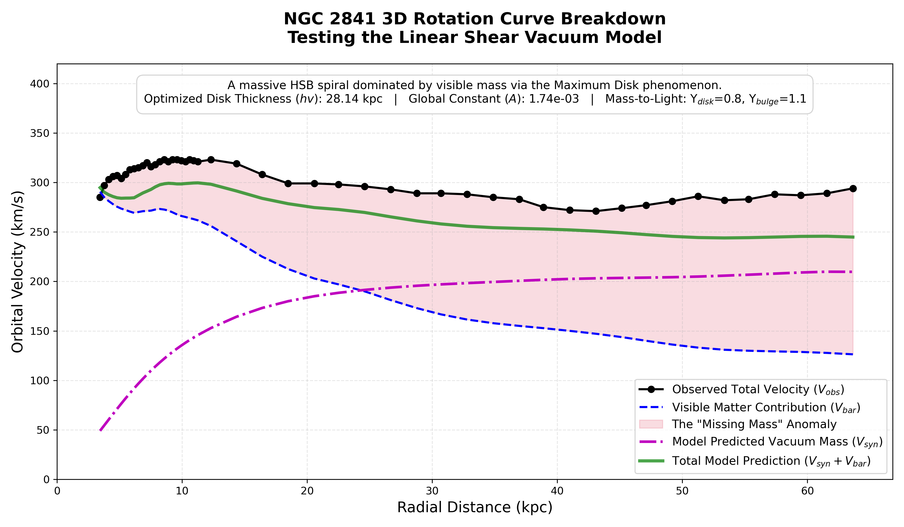
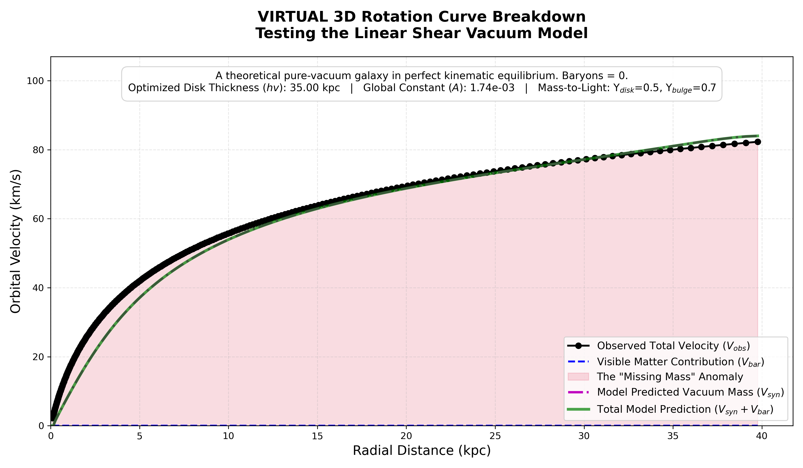

# Dark Matter Density Model: A Linear Shear Vacuum Model


Traditional astrophysics relies on invisible "Dark Matter" halos or modified gravitational laws (MOND) to explain why galaxies rotate faster than their visible mass allows.

**Hypothesis:** This repository tests a radically different alternative: The "missing mass" effect is an emergent property of the spacetime vacuum. Rather than adding invisible particles or tweaking Newton's equations, we propose that the effect is generated dynamically by the kinematic shear of space itself. In this model, the vacuum rotates in tandem with baryonic matter, eliminating the need for:

* Dark Matter particles
* Modified gravity models

This approach treats the galactic rotation anomaly not as a lack of matter, but as a direct result of the kinematic coupling between matter and the underlying spacetime fabric.

## Data Structure & Isolating the "Missing Mass"
This model utilizes the [SPARC (Spitzer Photometry & Accurate Rotation Curves)](http://astroweb.cwru.edu/SPARC/) database, which provides detailed, spatially resolved kinematic profiles for ~150 galaxies. For each radial distance ($R$), the dataset provides the total observed orbital velocity ($V_{obs}$) alongside the baseline Newtonian velocity contributions from the visible matter: the gas ($V_{gas}$), the stellar disk ($V_{disk}$), and the stellar bulge ($V_{bulge}$).

To isolate the "missing mass" velocity—the exact gravitational deficit that standard physics attributes to a dark matter halo—the script subtracts the visible mass contributions from the total observed velocity. 

Following standard astronomical conventions, the visible stellar components are scaled using fixed Mass-to-Light ratios ($\Upsilon_{disk} = 0.5$, $\Upsilon_{bulge} = 0.7$). The isolated "true" missing mass velocity ($V_{true}$) is calculated via the subtraction of squared velocities (as velocity squared is proportional to mass):

$$V_{true} = \sqrt{V_{obs}^2 - \left(\Upsilon_{disk} V_{disk}^2\right) - \left(\Upsilon_{bulge} V_{bulge}^2\right) - V_{gas}|V_{gas}|}$$

*(Note: The gas velocity term uses $V_{gas}|V_{gas}|$ to safely handle potential negative velocity artifacts in the raw radio data).*

This calculated $V_{true}$ represents the exact velocity curve that the Linear Shear Model must perfectly predict using only the spatial geometry of the visible matter.

## The Universal Equation
Instead of tuning independent halos, this model applies a single physical law to the entire [SPARC database](https://cdsarc.cds.unistra.fr/ftp/J/AJ/152/157/) (~150 galaxies). 
Following an optimization across thousands of kinematic data points, this project discovered that galactic missing mass acts linearly and follows a strict universal constraint:

$$\rho_{DM} = (1.74 \times 10^{-3}) \cdot \mathrm{Shear}$$

Where:
* **$\rho_{DM}$**: The required missing (dark matter) mass density.
* **$\mathrm{Shear}$**: The 2D kinematic shear of space itself as it co-rotates with the visible baryonic matter (stars and gas) of the galaxy.
  * Calculated as: $\sqrt{(\partial\Omega/\partial R)^2 + (\partial\Omega/\partial z)^2}$
  * $\Omega$ = Angular Velocity
  * $R$ = Radial Distance
  * $z$ = Vertical Distance from the midplane
* **$1.74 \times 10^{-3}$**: A global coupling constant.

### The Physics of Shear: The "Track and Field" Analogy
If the concept of "kinematic shear" is difficult to visualize, imagine a standard athletics track. 

Place a line of runners side-by-side across all the lanes, from the innermost lane to the outermost. Now, have every runner sprint at the **exact same linear speed** (e.g., 15 km/h). 

Because the runner on the inside lane has a much shorter distance to travel to complete a lap, they will quickly pull ahead of the outer runner—even though their speedometers read the exact same number. If those runners were holding hands, their arms would be stretched and violently pulled apart as the inner runner outpaces the outer one. This continuous stretching and spatial deformation between adjacent lanes is what physicists call **Shear**.

Galaxies operate on this exact same principle. Because galaxies exhibit "flat rotation curves," a star near the galactic center and a star near the outer rim are moving through space at roughly the same speed. The inner star completes its orbit much faster, causing the physical layers of the galaxy to constantly slide past one another. In this model, the immense kinetic energy of that sliding friction—the geometric shear of spacetime itself—is what generates the gravitational density we currently call "dark matter."

## From Density to Velocity: The 3D Integration
To prove this linear equation matches observational reality, the provided Python script translates the local shear density back into the metric used by astronomers: rotational velocity ($V_{syn}$). It achieves this through a rigorous 3D spatial integration:

1. **The Spatial Density Field:** The script calculates the kinematic shear across a high-resolution 2D cylindrical grid ($R, z$) based on the visible disk. The shear is defined mathematically as:
   $$\mathrm{Shear} = \sqrt{(\partial\Omega/\partial R)^2 + (\partial\Omega/\partial z)^2}$$
   It then applies the universal constant to generate a volumetric "missing mass" density field ($\rho_{DM}$).
2. **Newtonian Integration:** Because the shear-generated mass is distributed continuously throughout the galaxy, it cannot be treated as a point mass. The script calculates the exact gravitational inward pull ($a_{total}$) on a star at radius $R$ by integrating the force vectors from every discrete voxel ($dV$) in the 3D space surrounding it using standard Newtonian distance kernels.
3. **Kinematic Conversion:** Finally, using classical mechanics, the total inward gravitational acceleration is converted into the predicted circular orbital velocity required to keep the star stable: 
   $$V_{syn} = \sqrt{R \cdot a_{total}}$$

This derived $V_{syn}$ is then directly compared to the true observational data ($V_{true}$) to calculate the model's global accuracy.

## Model Validation
The script `dark_matter_model_residuals.py` calculates the 3D geometry and spatial shear for every galaxy, dynamically finds the true physical disk scale height, and generates a global residual analysis. The resulting multi-panel plot demonstrates the accuracy of this single equation when evaluated against the entirety of the SPARC dataset, spanning giant spiral galaxies (300 km/s) down to dwarf galaxies (30 km/s) with **zero individual density tuning**.

 *(Run the script to generate this plot)*

### Interpreting the Residual Dashboard
To mathematically validate the Linear Shear Model, the script generates a four-panel residual analysis across the entire SPARC dataset:

* **Panel 1: Model Prediction vs. Observation (Scatter Fit)** This panel plots the model's synthetic velocity ($V_{syn}$) against the true missing mass velocity ($V_{true}$). A perfect physical model would fall exactly on the dashed 1:1 line. The data uses transparency to indicate density—the dark blue clustering along the diagonal proves that the scaling is globally accurate.

* **Panel 2: Spatial Distribution of Error (Radius Check)** This panel plots the absolute velocity error (km/s) against the radial distance from the galactic center. The log-scale x-axis visually expands the inner $0$ to $5$ kpc region. This plot shows a tightly balanced distribution centered exactly at $0$ km/s across all radii, proving the linear shear geometry naturally flat-cores without artificial mathematical tapers.

* **Panel 3: Mass/Velocity Scale Distribution (Universality Check)** This panel plots the absolute velocity error against the observed true velocity ($V_{true}$) on a log scale. It answers a critical physics question: *Does the model fail for massive galaxies or dwarf galaxies?* Because the data forms a flat, horizontal band straddling the 0 km/s line across the entire spectrum ($10$ km/s to $300$ km/s), it proves the $1.74 \times 10^{-3}$ coupling constant is universal, requiring no mass-dependent tweaking.

* **Panel 4: Global Absolute Error (Histogram)** This panel aggregates every data point across all ~150 galaxies into a single absolute error distribution. The result is a normally distributed bell curve with a **Median Error of just 0.3 km/s**.

### Note on the Interquartile Range (IQR) Bands
Across all four panels, the dotted black lines represent the 25th and 75th percentiles of the absolute error. This Interquartile Range (IQR) visually bounds the "middle 50%" of the entire dataset. Because these bands run tightly parallel to the perfect fit/zero-error lines across all radial distances and all mass scales, they mathematically demonstrate that the model's predictive variance remains strictly uniform, suffering from neither spatial divergence nor mass-dependent bias.

### Gallery of Results: The Kinematic Spectrum
To prove the universality of the $A = 1.74 \times 10^{-3}$ coupling constant, the batch processor was run across the extreme boundaries of the SPARC database. Notice how the model seamlessly adapts to drastically different physical environments without needing individual parameter tuning.

#### 1. The Low-Mass (Pure Vacuum) Limit: DDO 154
In gas-rich Dwarf Irregular galaxies, visible mass is almost non-existent. The model successfully predicts that the geometric shear of the vacuum must account for over 90% of the rotational velocity.


#### 2. The "Goldilocks" Standard: NGC 2403
In a typical star-forming spiral, the model demonstrates the "Disk-Halo Conspiracy." Exactly as the visible mass (blue dashed line) begins to die off, the vacuum shear dynamically scales up to seamlessly catch the curve and keep it flat.


#### 3. The High-Mass Limit: NGC 2841
In massive, bulge-dominated spirals, the visible mass is so dense that it forces the inner galaxy to rotate at >250 km/s via standard Newtonian gravity. The model correctly identifies that the inner region requires zero vacuum mass, only kicking in at the extreme outer edges.


#### 4. A virtual galaxy without matter: VIRTUAL
cdsarc type data created through python script: create_virtual_galaxy.py 
This represents a stable galaxy without matter.
This indicates that galaxies have a natural tendency to evolve towards flat rotation curves


## Getting Started

### Prerequisites
You will need [Conda](https://docs.conda.io/en/latest/) or a standard Python environment. The dependencies include `pandas`, `numpy`, `scipy`, `matplotlib`, and `openpyxl`.

### Installation
1. Clone this repository:
```bash
   git clone [https://github.com/yourusername/dark_matter_density_model.git](https://github.com/yourusername/dark_matter_density_model.git)
   cd dark-matter-density-model
```
2. Create and activate the required Conda environment using the provided YAML file:
```bash
    conda env create -f environment.yml
    conda activate dark-matter-density-model
```
### Running the Analysis
**1. Global Residual Analysis (All Galaxies)**
1. Keep or download the official SPARC database kinematics file (ensure you have the .xlsx or .csv version named cdsarc_152_157_table2.xlsx) and place it in the root directory of this repository.
2. Run the main evaluation script:
```bash
    python dark_matter_model_residuals.py
```
3. The script will output execution times, progress across the ~150 galaxies, and ultimately save Dark_Matter_Residuals_Analysis.png in the root folder.

**2. Global Residual Analysis (All Galaxies)**
To generate detailed, publication-grade rotation curves for specific galaxies, you can use the batch processor. This script calculates the 3D physics for target galaxies and overlays the model's geometric prediction ($V_{syn}$) onto the true observed missing mass anomaly.Open the config.yml file to list the galaxies you want to evaluate. You can also define custom Mass-to-Light ratios ($\Upsilon$) or fixed scale heights ($hv$) for extreme edge-cases.
```bash
    python generate_rotation_curves.py
```
The script will automatically create a galaxy_rotation_curves/ folder and populate it with high-resolution .png graphs for every galaxy listed in your configuration file.

### Project Structure
* cdsarc_152_157_table2.xlsx: the input file containing the mass models for 175 disk galaxies with [SPARC](https://cdsarc.cds.unistra.fr/ftp/J/AJ/152/157/ReadMe)
* dark_matter_model_residuals.py: The core physics engine and plotting dashboard.
* generate_rotation_curves.py: The batch processing script for generating individual, highly detailed rotation curves.
* create_virtual_galaxy.py: Generates the input data (virtual_vacuum_galaxy.csv) for a galaxy without matter
* generate_rotation_curves_virtual.py: A copy that points to the virtual galaxy
* galaxies_to_generate.yml: The configuration file for the batch processor, allowing for dynamic parameter overrides (e.g., Mass-to-Light ratios) per galaxy.
* virtual_galaxy_to_generate.yml: Same config file but just for the virtual galaxy
* galaxy_rotation_curves: An auto-generated directory containing the output .png files from the batch processor.
* environment.yml: Dependency management file for exact scientific reproducibility.
* README.md: Project documentation.

### Discussion & Cosmological Implications
The standard astrophysical response to the galaxy rotation problem is to add invisible mass. 
This project set out to test a fundamentally different hypothesis: the required gravitational pull is generated entirely by the kinematic shear of space itself.

### Open Invitation for Review
This repository is open-source, and the results are reproducible using the provided Python scripts and the public SPARC database. 
Anyone is invited to clone this repository and attempt to falsify or expand upon this linear shear model. 

## Acknowledgments & Methodology
The physical hypothesis, the Track and Field analogy, and the mathematical framework of the Linear Shear Vacuum Model are original research. 

The Python codebase—specifically the 3D spatial integration architecture, the SciPy minimization loops, and the Matplotlib publication-grade data visualizations—was co-authored and refactored with the assistance of Google's Gemini AI. Gemini was utilized to translate the theoretical physics into optimized, computationally efficient code and to ensure the repository meets professional software engineering standards.